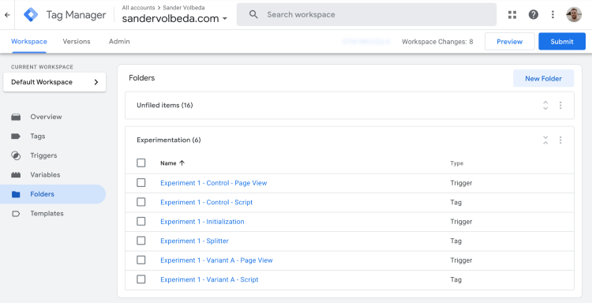

# Folder Structure

Since there are numerous tags, triggers, and variables involved in experimentation, it is advisable to organize everything related to experimentation into a single folder (or create multiple folders if you prefer to structure them per experiment).

1. Open Google Tag Manager.
2. Select **Folders** in the left-hand menu.
3. Click **New Folder**.
4. Name it: **Experimentation**.
5. Select all **Experimentation**-related items (do not include GA configuration).
6. Select **Move** and move the items to the **Experimentation** folder.

