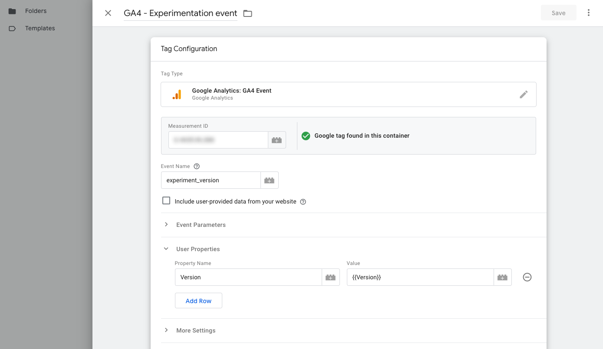

# Google Tag Manager

## Workspace
It is recommended to avoid working directly on the master branch (or the default Workspace in this case). To begin, launch GTM (Google Tag Manager). In the left sidebar, locate the Default Workspace option and click on it. Then, in the upper right corner, look for the + icon and click on it.


| Field:         | Input:           |
| ------------- |:-------------|
| **Name**    | Experimentation setup |
| **Description**   | Setting up everything to start with experimentation    |

**Save**.

This will help ensure that no one else is working on the same version of the code as we are. It is a security measure to prevent conflicts and data loss.

---

## Variable (Version)

The first step is to create a new variable. This JavaScript will create the ``version`` row in the visitor's browser ``localStorage``.

> It is important to note that browsers do not automatically reset ``localStorage``, unlike cookies. Visitors can manually reset it by clearing their browser's cache and other stored data, but this is unlikely. As a result, running experiments in this manner can last longer than cookies that are automatically reset, which can improve the accuracy of your data.

**Steps:**

1. In the sidebar, navigate to **Variables**.
2. Click Add new **User-Defined Variable**.
3. Name the variable **Version**.
4. In the **Variable Configuration** section, select **Variable Type** as **Custom JavaScript**.
5. Copy and paste the following code into the variable:
    ``` py linenums="1"
    function() {
      var keyValue = localStorage.getItem('version');
      return keyValue;
    }
    ```
6. **Save**


---

## Triggers

Next, the triggers. Three triggers are required to execute a single experiment:

* Initialization trigger: This trigger fires when the experiment is first initialized.
* Control – Page View: This trigger fires when a visitor views the control page.
* Variant – Page View: This trigger fires when a visitor views the variant page.

### Initialization

This trigger fires when the experiment is first initialized. To create it, follow these steps:

1. In Google Tag Manager, navigate to **Triggers**.
2. Click the **New** button to create a new trigger.
3. Name the trigger **Experiment 1 – Initialization**.
4. Select **Initialization** as **Page View**.
6. Select **This trigger fires on** as **Some Initialization Events**.
    
    | Field:         | Input:           |
    | ------------- |:-------------|
    | **First**    | Page path |
    | **Second**   | equals |
    | **Third**    | / |

7. Click **Save**.

> 1. If the **Path** option is not in the list, select **Choose Built-In Variable** and then select **Page path**.

> 2. The third field with the ``/`` represents the homepage.

> 3. This is also where you can add more requirements, such as device targeting.


---

### Control - Page View

Next, we will create the trigger for the control experiment. To do this, follow these steps:

1. In Google Tag Manager, navigate to **Triggers**.
2. Click the **New** button to create a new trigger.
3. Name the trigger **Experiment 1 – Control – Page View**.
4. In the **Trigger Configuration** section, select **Trigger Type** as **Page View** and **Trigger Event** as **Page View**.
5. In the **Trigger Details** section, select **This trigger fires on** as **Some Page Views**.
6. Add the following details to the first row.

    | Field:         | Input:           |
    | ------------- |:-------------|
    | **First**    | Version |
    | **Second**   | matches RegEx |
    | **Third**    | ```Slot 0$|Slot 1$|Slot 2$|Slot 3$|Slot 4``` |

7. Add an additional row with the following details.

    | Field:         | Input:           |
    | ------------- |:-------------|
    | **First**    | Page path |
    | **Second**   | equals |
    | **Third**    | / |

8. Click **Save**.


---

### Variant - Page View

Now, let’s delve into the experiment trigger (for the variant).

1. In Google Tag Manager, navigate to **Triggers**.
2. Click the **New** button to create a new trigger.
3. Name the trigger **Experiment 1 – Variant – Page View**.
4. In the **Trigger Configuration** section, select **Trigger Type** as **Page View** and **Trigger Event** as **Page View**.
5. In the **Trigger Details** section, select **This trigger fires on** as **Some Page Views**.
6. Add the following details to the first row.

    | Field:         | Input:           |
    | ------------- |:-------------|
    | **First**    | Version |
    | **Second**   | matches RegEx |
    | **Third**    | ```Slot 5$|Slot 6$|Slot 7$|Slot 8$|Slot 9$``` |

7. Add an additional row with the following details.

    | Field:         | Input:           |
    | ------------- |:-------------|
    | **First**    | Page path |
    | **Second**   | equals |
    | **Third**    | / |

8. Click **Save**.


---

## Tags

It is now time to add three new tags and make adjustments to the  configuration. This will ensure that the data is sent to the custom definition we created in GA.

### Splitter Tag

Once the **Initialization trigger** has been activated, we will use a tag to randomly assign visitors to either the **control** or **variant**. This **split tag** will be triggered accordingly.

To create the split tag, follow these steps:

1. In Google Tag Manager, navigate to **Tags**.
2. Click the **New** button to create a new tag.
3. Name the tag **Experiment 1 – Splitter**.
4. In the **Tag Configuration** section, select **Tag Type** as **Custom HTML**.
5. Copy and paste the following code into the **Custom HTML** block:

    ``` py linenums="1"
    <script>
      (function () {
      var slots = 10;
      var version;
      if (localStorage.getItem('version')) {
        version = localStorage.getItem('version');
      } else {
        var random = Math.floor(Math.random() * slots);
        version = 'Slot ' + (random);
        localStorage.setItem('version', version);
      }
      return version;
      })();
    </script>
    ```

6. Select the **Trigger** as **Experiment 1 – Initialization**.
7. Click **Save**.


---

### Control Tag

Once the **splitter tag** has successfully executed and the user falls within one of the slots from **0 to 4**, the **control tag** will be triggered.

To create the control tag, follow these steps:

1. In Google Tag Manager, navigate to **Tags**.
2. Click the **New** button to create a new tag.
3. Name the tag **Experiment 1 – Control – Script**.
4. In the **Tag Configuration** section, select **Tag Type** as **Custom HTML**.
5. Copy and paste the following code into the Custom HTML block:

    ``` py linenums="1"
    <script>
      (function () {
        // experiment code here
        console.log("Control loaded");
      })();
    </script>
    ```
    
6. Select the **Trigger** as **Experiment 1 – Control – Page View**.
7. Click **Save**.


> A script is also being run for the control variant. This allows for additional tracking to be set up, for example.


---

### Variant Tag

Once the **splitter tag** has successfully executed and the user falls within one of the slots from **5 to 9**, the **variant tag** will be triggered.

To create the variant tag, follow these steps:

1. In Google Tag Manager, navigate to **Tags**.
2. Click the **New** button to create a new tag.
3. Name the tag **Experiment 1 – Variant – Script**.
4. In the **Tag Configuration** section, select **Tag Type** as **Custom HTML**.
5. Copy and paste the following code into the **Custom HTML** block:

    ``` py linenums="1"
    <script>
      (function () {
        // experiment code here
        console.log("Variant loaded");
      })();
    </script>
    ```

6. Select the **Trigger** as **Experiment 1 – Variant – Page View**.
7. Click **Save**.

> This is where you can add the JavaScript for your experiment to manipulate the page.


---

## GA Confirguration tag

To complete the setup, we need to edit the Google Analytics tag.

1. Open the GA configuration tag.
2. In the **User Properties** section, add a new row.
3. In the **Property name** field, enter ```Version```.
4. In the **Value** field, enter the value of the ```Version``` variable.
5. Click **Save**.

