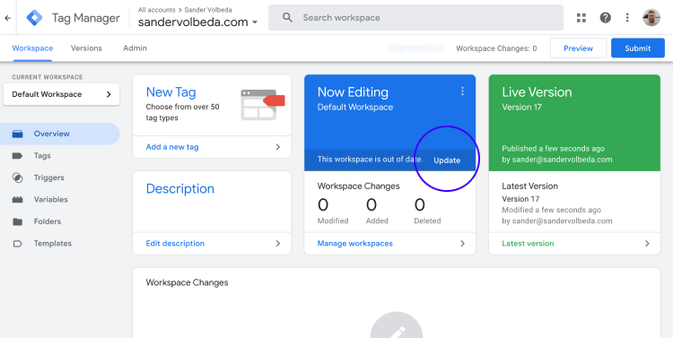

# Publish Setup/Experiment

The setup is complete. To publish the experiment, follow these steps:

1. Click the blue **Submit** button in the top right corner.
2. Click **Publish**.
3. Close the slide-in.
4. Go to **Workspace** tab.
5. Click **Update** (next to **This workspace is out of date**).
6. Click **Update**.

The experiment is now live!

> Important: Always start with an A/A test, which means no changes to the website, to make sure you collect the data you need. This setup includes an A/A test. Once you have published everything, make sure to check your website and the page you are running the experiment on with the console log of the developer tools. This will either show the message **Control loaded** or **Variant loaded**.