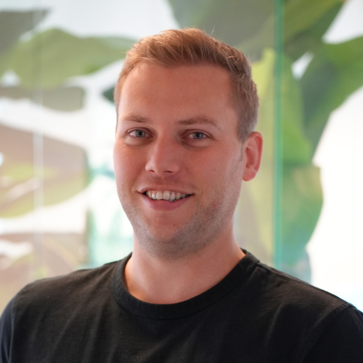

# About

Hello there! I'm Sander, a Freelance Conversion Optimization (CRO) specialist based in Groningen, the Netherlands. Let me share a bit about myself and my journey in the world of CRO.

[Hire me](https://sandervolbeda.com/){.md-button .md-button--primary target="_blank"}

Born in 1991 and a proud dad of two boys, Wolf and Luca, I'm not just passionate about CRO; I'm also an avid sports enthusiast, a Formula 1 fanatic, and I enjoy building my own CRO SaaS product(s). Working remotely, I've had the privilege to collaborate with international brands, running over 500 experiments and founding CRO-tool.com. My skills encompass CRO (Conversion Optimization), UX (User Experience), Design, and Front-end (HTML, CSS/SCSS, JavaScript), and I'm well-versed in the Google Stack, including Analytics, Tag Manager, and the no longer available Optimize ... the last one is reason why I created this website.

You might have come across my work in various publications and podcasts, where I've delved into the fascinating intersection of psychology and CRO. My [LinkedIn profile](https://www.linkedin.com/in/sandervolbeda/){target="_blank"} is the place to connect with me and stay updated on my latest insights.

Conversion optimization became my calling because I grew tired of opinions ruling the game. It's the data-driven nature of CRO that truly appeals to me. Instead of making sweeping website changes, risking conversion losses, I advocate for optimization through experimentation. By consistently testing and adapting based on customer preferences, we can steadily improve conversion rates.

My journey into CRO began with an unexpected twist. Initially, I pursued a career in design but later transitioned into front-end development. Despite the apparent detour, each step contributed to my evolution as a CRO specialist. My professional path all came together to shape my unique expertise in the field.

Thank you for taking the time to learn more about me and my passion for conversion optimization. I'm excited about the possibilities this field offers and eager to explore them further with you.

<iframe src="https://gnexperimentation.substack.com/embed" width="480" height="320" style="border:1px solid #EEE; background:white;" frameborder="0" scrolling="no"></iframe>